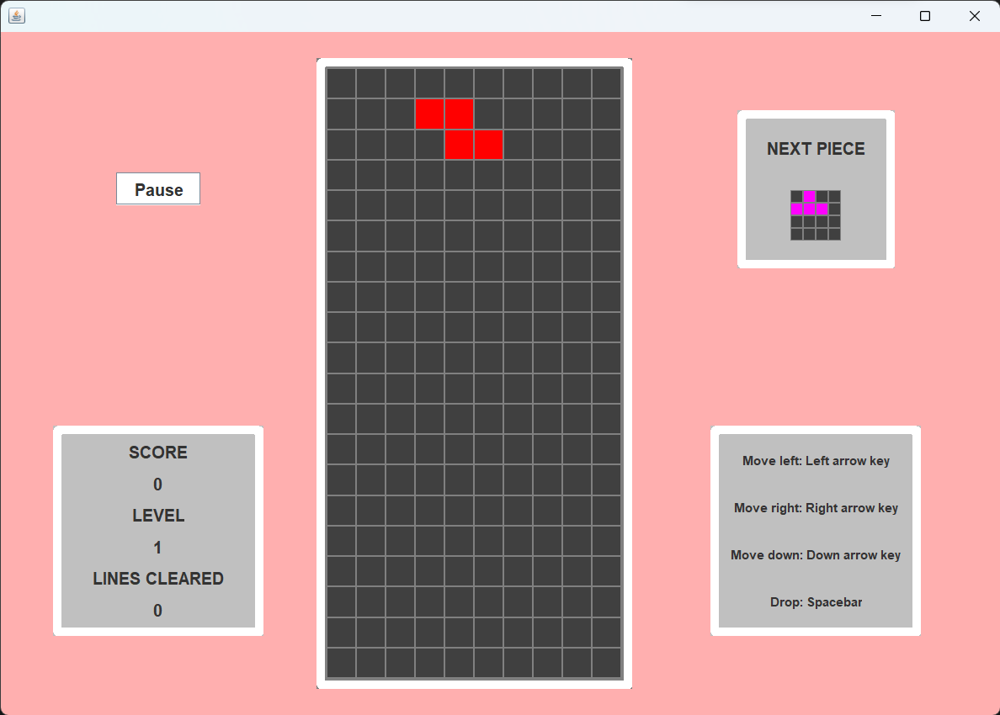
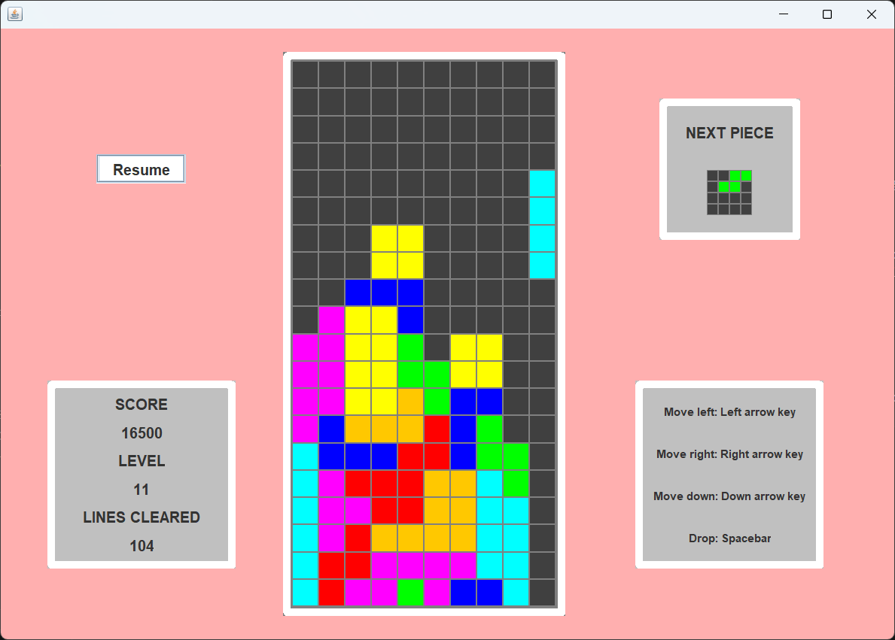
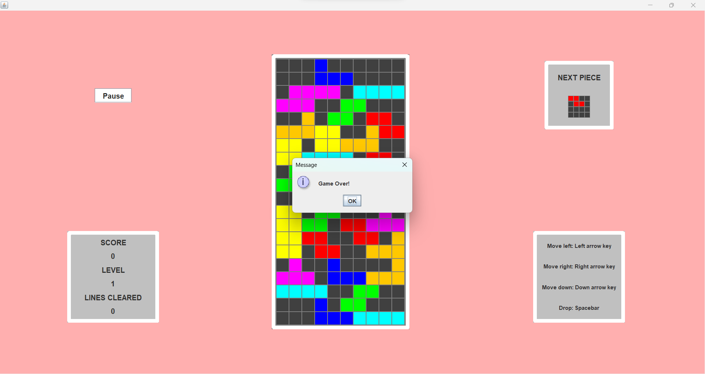
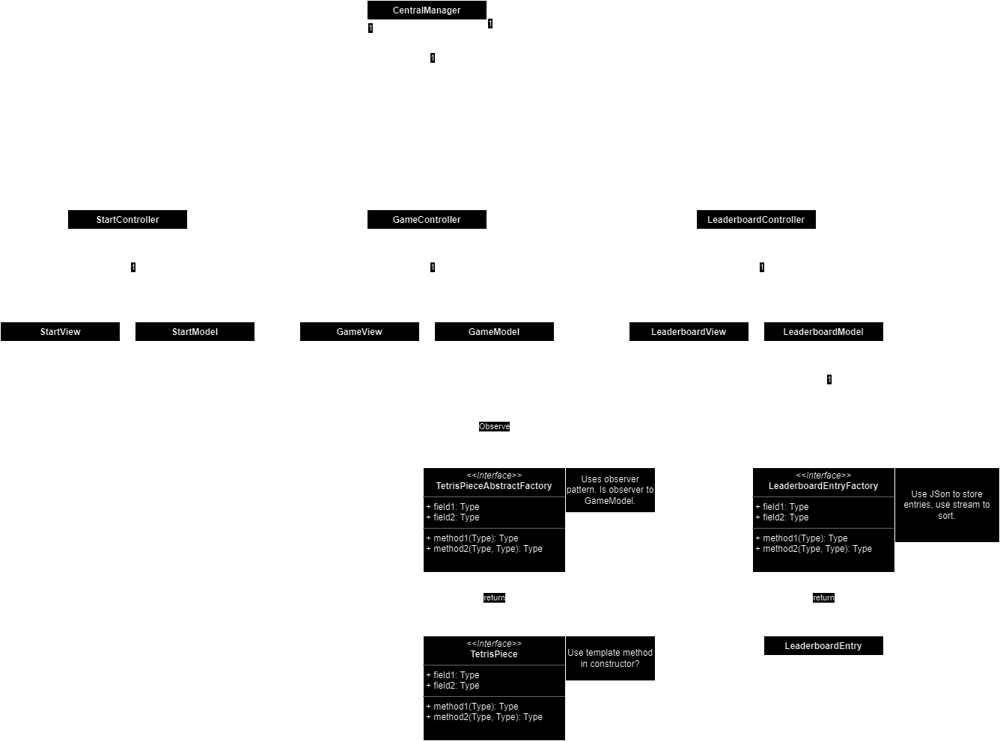

# Screenshots

# Final Project

## Environment & Tools
HP-laptop with Windows 11, IntelliJ IDEA Ultimate 2023.2.1, java 20.0.2 2023-07-18, Apache Maven 3.9.4, git version
2.42.0.windows.1

## Purpose
The purpose of this project is to create a tetris-like game. Tetris is a game where pieces made out of four squares, 
called tetriminos, are to be placed on a 10x20 game board, and the players' goal is to clear lines on this board by 
filling up the rows, the player then gains some amount of points, more lines cleared at once equals more points. The 
game ends when the game can no longer spawn a tetrimino at the top of the board, and the game then ends.

I am aiming for the grade D and the concrete goals for this grade include:

- The application must be made using swing and must be somehow event driven.
- The application must make use of the MVC design pattern, where the view and model cannot know of each other's 
- existence.
- At least two threads need to be running at the same time.
- There needs to be at least four unique swing components and at least two swing layouts used.
- At least three of the design patterns that have been covered in the course must be used; these patterns include 
Object Pool, Observer, Producer / Consumer, Template Method, Abstract Factory and Factory Method.

## Procedures
The first step was to create the controller class of the MVC design pattern named "GameController" since this is the 
center of the application. The controller instantiates both the model and the view which will be explained further down.
In the constructor, the controller first sets focus on the view window; otherwise the keys don't work. It then adds 
action listeners to the appropriate keys using methods in the view. The left and right key activate when the key is 
pressed, this makes it so the piece keeps moving if we hold the key which is desired. Unlike the drop or rotate keys, 
these are activated when the button is released, which makes it not keep rotating or dropping when held. These action
listeners also check if the game is paused and if it is, no actions can be performed by the player. In the constructor
the controller also adds an action listener to the pause buttons which uses the model to pause the game and adds a timer
to `updateView()`. `updateView()` is a helper function that updates the view using the views method `displayGameBoard()`
passing all the needed values from the model. The next function is `tetriminoColorMap()` which takes all the tetriminos
and adds them to a map where the key is the id of the tetrimino and the value is the color of the tetrimino, this 
function is needed so that the view does not interact directly with the tetrimino class which would break the MVC 
pattern. There also is a function `switchPauseGame()` which calls the models method `switchPause()`. Next is the method
`startGame()` which resets the game, starts a timer on `model` which implements `Runnable` and then the timer which 
updates the view is started again. Finally, is the method `stopGame()` which stops the game timer, shows a game over pop
up using a method by the view and then adds a new `actionListener` to the pause button which now starts a new game 
instead the listener removes itself after it is pressed.

Next the view of the MVC pattern was created, this class is named `GameView`. The view extends `JFrame` so that it can
display all the swing components. Before the constructor all the components are initialized, this is done so that the 
constructor is not too bloated. In the constructor the first step is to add values to a color map, this map takes a 
value from the `TetriminoColor` enums and maps this to a `Color` class, this way the view know what color to display and
the model and controller need not worry about what kind of color it contains. The view uses the `gridBagLayout` and the
frame contains one, pause `JButton` in the top left, one info panel `JPanel` with labels that show score, line cleared 
and level. The game board is represented using the `gridLayout` since the board is a grid. Then an on the top right is a
`JPanel` showing the next tetrimino, and finally on the bottom right are instructions to the game. In the constructor 
colors, fonts and size of all components are set. The game board is colored like this:

    for (int i = 0; i < 200; i++) {
            JPanel panel = new JPanel();
            panel.setBackground(Color.DARK_GRAY);
            panel.setBorder(new LineBorder(Color.GRAY));
            gameBoard.add(panel);
            gameBoardPanels.add(panel);
        }

The first method is a helper method that creates a `gridBagConstraints` which makes the syntax cleaner. Then are 
methods to add `actionListeners` to all keys and the pause button. Then there is a method that changes the text on the 
pause button depending on the game is paused or not. Next is a method to show a pop-up when the game is over, this 
method also sets the pause button to "New Game." Lastly, is the method `displayGameBoard`. The game board will be more 
thoroughly explained in more detail under the model section, but basically the board contains 0 for all empty squares
and then the tetriminos id for the squares that are occupied. So this method is passed the game board as a 2d array, a 
map with the value is the color, and the key is the id of the tetrimino, a shape for the next tetrimino and its color; 
this is needed since this is not a part of the game board. Then it also passes the score, lines cleared and level, so
it can display this in the appropriate place. To display the game board in the view a 1d array is first created, this 
matches better with the `gridLayout` where squares in the grid are called as 1d not 2d. Then for each cell the color 
is gotten from the map if the square is not 0 and colored in. The same logic is used for the next piece tetrimino. 

The `TetriminoColor` enums are just constants which refer to the color of the tetrimino, theses are used by tetrimino
to store its own color and by the view to translate to an appropriate color depending on the implementation. This 
application is using swing so the `Color` class is used. 

The next classes to be implemented are the tetrimino pieces. Firstly there is a `BaseTetrimino` abstract class which is
inherited from by all subclasses. This class contains a `static` `numberOfPieces` field and a `id` field to give the 
pieces a unique id. It has a field for all the rotations/shapes of the tetrimino. All the shapes are represented as a
4x4 2d array, this makes it so that it is controllable how the piece rotates in this grid. The position of the piece is 
based on this shape grid where the y, x cordinate is the top left of the shape. The shapes also have an index of which 
place it has in the list, this is useful when coming to the end of the list and a rotation is called the list starts 
back at index 0. It also has a field for the color which is a `TetriminoColor` enum. In the constructor a method 
`initializeTetrimino()` is called, this is a template method where the id is set by this abstract class, but lets its 
subclasses set the color and shapes. The method `getTetriminoShape()` returns the shape from the list which matches the
`currentShapeIndex`. `peekNextTetrimino()` returns the next piece without rotating the piece, this is useful for 
checking if the piece can actually rotate or if it is blocked somehow. `rotate()` rotates the tetrimino using the 
`currentShapeIndex` and setting it to 0 if the end of the list is reached. The tetrimino is also responsible for moving
itself down, left and right, it does this using the position field and adjusts this as necessary. Lastly, it has a 
getter and setter for the position and getters for id and color. The subclasses are fairly straight forward and just 
overrides the methods from the `initializeTetrimino()` template method which are `setShapes()` and `setColor()`. 
`setColor()` just set the color to an `TetriminoColor` enum. `setShapes()` sets all the rotations of the piece, and 
below is an example of the I-shape tetrimino:

    shapes.add(new int[][] {
                {id, id, id, id},
                {0,  0,  0,  0},
                {0,  0,  0,  0},
                {0,  0,  0,  0}});

        shapes.add(new int[][] {
                {0, id, 0, 0},
                {0, id, 0, 0},
                {0, id, 0, 0},
                {0, id, 0, 0}});

The classes `GameModel` and `TetriminoFactory` uses the observer pattern where the factory observers the model, so the 
next step is to implement these interfaces. `Observable` is an interface used for the `GameModel` which has methods for
attaching and detaching an observer and also a method to update all observers in its list. The `Observer` class just has 
the one method `update` which performs the action implemented by the concrete observers.

The `GameModel` class implements the `Observable` interface as mentioned, it also implements `Runnable` and the `run()`
contains the game loop which will be described below. It contains a list of observers, a `deque` of the upcoming 
tetriminos, a `BaseTetrimino` which is the current piece controlled by the player and a list of all the tetriminos that
have been placed on the board called `allPieces`. The game board is represented as a 2d integer array which is the size 
20x10. As mentioned previously, the squares which are empty are represented as 0 and the occupied squares are represented
as their own id. This makes it, so we can get the color of each square and any other info necessary. It contains integers
for tick length, score, lines cleared and level which are updated as needed in the model. Finally, there are two booleans, 
one for game over and one for paused. Since this is a multithreaded application, we need some synchronization on some
of these fields. Those fields that can be accessed by multiple threads are `nextTetriminos`, `allPieces`, `isGameOver`, 
`isPaused` and `gameBoard`. The lists use concurrent collections, the booleans use `AtomicBoolean` and the `gameBoard`
use an object lock to use in synchronized blocks. The constructor creates a factory which will be explained later, it 
then gets the first piece and updates the game board. Firstly, there are getter methods for the `gameBoard`, `score`,
`linesCleared`, `level`, `allPieces`, `nextTetriminos` and `nextTetrimino`. The private method `updateGameBoard()` 
updates the game board by first clearing the board of the current tetrimino then adding it again using the current shape
and position of the tetrimino. It does this with the help of `clearCurretnPiece()` which just goes over the game board 
and sets all squares to zero where it matches the current piece id. The `rotateCurrentPiece()` checks whether the current
piece can be rotated and if it can call `rotate()` on the current piece. This is a recursive function, this is because
if the tetrimino cannot be rotated, it tries to move the piece either left or right depending on the position and then
tries again. For each recursive call the counter for `recursiveDepth` is decreased and if 0 returns and if it has not 
yet been able to rotate it does not rotate. Then there are the methods `moveCurrentPieceLeft()` and 
`moveCurrentPieceRight()` these methods checks if the tetrimino can move either left or right by checking the squares 
around the squares of this pieces id and if all squares that will be occupied are either 0 or the id of the current 
piece the move can be done. The `moveCurrentPieceDown()` works the same way as the above functions. The `dropPiece()`
moves down the tetrimino for as long the tetrimino does not change at which point it stops the drop. 
`changeCurrentPiece()` changes the current piece by popping from the `nextTetriminos` list. This method sets the 
starting position of the piece. It also checks if the game is over, it does this by checking if where the tetrimino 
are placed is already occupied by another piece, if this is the case the game is over. Lastly this method notifies its
observers, or the factory, since a piece is popped from the `nextTetriminos`. Next is the `checkClearLines()`, this is 
called from the `moveCurrentPieceDown()` and if the piece can no longer moved down, it checks if any lines should be 
cleared by looking at the rows which the shape 2d array occupied and if any row does not contain any 0 it should be 
cleared. Then the score is updated based on the number of lines cleared. To actually clear the lines the method 
`clearLine()` is used. This sets all squares in the row to 0 and moves every row above this one down one step. 
`increaseLevel()` increases the level with a max level of 16 and decreases the tick lenght of the game. `updateScore()`
increases the score based on the number of lines cleared and is used by `checkClearLines()`. Next are getters and 
setters for `isGameOver` and `isPaused`. The `resetGame()` method resets the score, lines cleared, level, next pieces, 
all pieces, resets the game board and change the current piece. `resetGameBoard()` is used by the above method and sets 
every square to zero. Next are the methods from the `Observable` interface which are all self-explanatory. The `run()`
method from the `Runnable` interface is in charge of the actual game loop where the thread sleeps the amount of the tick
lenght and then moves the piece down for as long as the game is not paused or the game is over. 

The `TetriminoFactory` class acts as an abstract factory to initialize a number of tetriminos and adds them to the 
models upcoming tetriminos list. It contains a field model which is the model it will create tetriminos for. The 
factorys `update()` method, which is got from the `Observer` interface, checks if the `nextTetriminos` list size is less
than five if so it creates two of each tetrimino, adds them to a list, shuffles the list and then adds all tetriminos to
the models `nextTetriminos` list.

Lastly, in the main method, we just crate a controller on the event queue.

## Discussion
### Purpose Fulfillment
The purpose of this project has been fullfilled in accordance to what was stated in the purpose section. All the 
functionality of the tetris game works as intended such as tetrimino movement, lines being cleared, change of pieces and
that the game ends when no piece can no longer be placed. 

As for the concrete goals, I will go through them one by one and look at their fulfillment. The first one is that the 
application needs to be made using `swing` and be event driven. We can confirm this is the case by looking into the 
`GameView` class which indeeds uses swing to display the application to the user. We can also see that the application
is event driven by the fact that we move the tetriminos by using the arrow keys; also the pause button is event driven.
Next is that the application must use the MVC pattern, we can confirm this by looking at our class structure. Here we
have a view responsible for displaying the application and a model which handles all the logic and then the controller 
which acts as a middle hand. Note that the tetriminos classes also act as models in this case. This is all in 
accordance with the MVC pattern. To make sure that the views and models do not know about each other's existence, we can 
search all models and views and look for mentions of the other type. In our application, they do not have references to
each other. 

Next, at least two threads need to run concurrently. We have three in our application. One for the EDT which handles
the graphical output, one thread which queues updates to the view using the `InvokeLater()` method and lastly one thread
for the game loop as a `Runnable` one the model.

Another goal was to have at least four unique swing components, we have four including `JButton`, `JPanel`, `JFrame`,
`JLabel` and we also have a message dialog. At least two layouts also needed to be used which we have. The 
`gridBagLayout` is used for the panels and the `JFrame` to place the panels, then the `gridLayout` is used for the game 
board.

As for the design patterns, three is used in this application. The observer pattern is used by the model and the factory
so that the factory knows when to create more tetriminos. Then the abstract factory pattern is used to create 
tetriminos. The tetrimino factory creates a number of related objects which is tetriminos. Then lastly the template 
method pattern is used in the `BaseTetrimino` class and its subclasses. In this pattern the `BaseTetrimino` sets up a 
template method which is `initializeTetrimino()` and handles the `setID()` function itself but leaves the subclasses
to override and implement the steps to set the color and the shapes of the piece.

### Alternative Approaches
I first want to mention that I would like to have added more to this project than what is showed here, but the 
constraints of time did not allow me to. Here is a simple UML-diagram which I made before starting to code:

As shown, the plan was to include a start screen and a system/screen for a leaderboard. This is one alternate approach I
wish I would have had the time to include.

The way the tetriminos shapes were implemented felt a bit suboptimal. This is especially noticeable when trying to 
rotate or move the piece which requires some hard to follow logic. Although I'm not sure what a better implementation 
would be, I'm sure there are some more efficient ways to check if the tetrimino can move/rotate.

Another point is that since the tetriminos classes count as models, the view cannot directly interact with these. I did
not think this was the case until I received feedback from a previous lab. When this is the case, we have to work around
the problem by using maps or other ways to pass the data to the view, instead of just passing a list of tetriminos. This
feels to me like making things harder on yourself for no reason. Although I understand the reason which is to have loosely
coupled classes, I would not do it this way if I were making something on my own.

Finally, I feel that my code is quite bloated and hard to follow at places. If I were, to do it again, I would put more 
time into thinking hard about what is needed before starting to try my way to a solution that works. This aspect I feel
is apparently present in the view class in the `displayGameboard()` method and in the methods for moving the tetriminos
in the model. I could probably have used some helper methods in the latter case to reduce duplicate code and provide a
cleaner design overall.

## Personal Reflections
This project I found very challenging. I was excited in the beginning, and as mentioned previously, my scope was larger
than what I finally accomplished due to time constraints. That really was the hardest part to estimate what time 
something like this takes to finnish. Another challenge is to plan out the program. The best approach would be to plan
the whole program before starting to code, but my planning skills are lacking in this department, and I would simply not
be able to plan a program like this all at once. It was though very rewarding in the end even though there are quite a
few things I want to improve on. When I create like this, I first make sure the implementation works no matter how messy
or hard to follow the code is, then I think to myself that I can come back later and clean it up. But this is quite hard
both because its challenge to return to code when the rest of the program depends on this code, and it becomes a major
refactoring, and also because of the mentioned time constraints. 

But overall, it was fun to create something from scratch with this much freedom. This is not something I do on my own.
